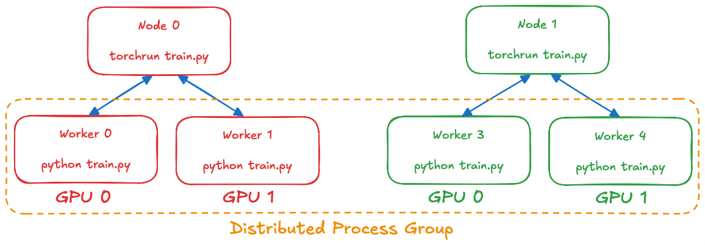
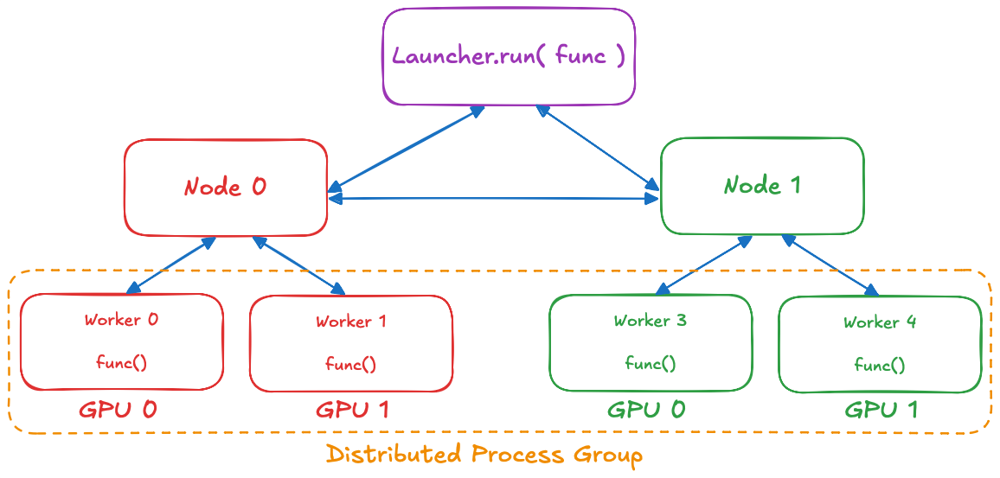

# How It Works

Suppose you want to run a script (`train.py`) on `N` machines (or "nodes") with `M` GPUs each.

You'll need to start a new process for each GPU. Each process will execute your script in parallel and select its GPU based on the process rank. Your script will also form a [distributed group](https://pytorch.org/docs/stable/distributed.html#torch.distributed.init_process_group) so the processes may communicate with each other (e.g. passing tensors).

## `torchrun`

Normally, you'd do this by running the `torchrun --node-rank {i} ... train.py ...` command on every machine. In short, you'll end up with a topology like:

As a side effect of this structure, every process will run until (1) script completion or (2) another process stops communicating (e.g. if killed by the system for abnormal reasons). The status of other processes is not actively communicated: so if some process is indeed killed, it would take 10 minutes (by default) for the remaining processes to time-out. Also, since this approach parallelizes the entire script, we can't catch and handle these system-level issues as exceptions.

## `torchrunx` 🔥

`torchrunx` offers a functional interface, with a launcher–worker topology, instead.

{func}`torchrunx.Launcher.run` runs in the current, *launcher* process. It uses SSH to start an *agent* process on every node (specified in `hostnames`), which in turn spawn `M` *worker* processes. The workers form a distributed process group and each executes `func(*args, **kwargs)` in parallel. Once all workers are finished, all of their returned values are propagated to the initial launcher process. Our agents constantly communicate (over their own GLOO-backend distributed group), so any agent or worker failures are immediately propagated, and all launched processes are terminated. Worker exceptions and system failures are propagated to and raised by {func}`torchrunx.Launcher.run`.
